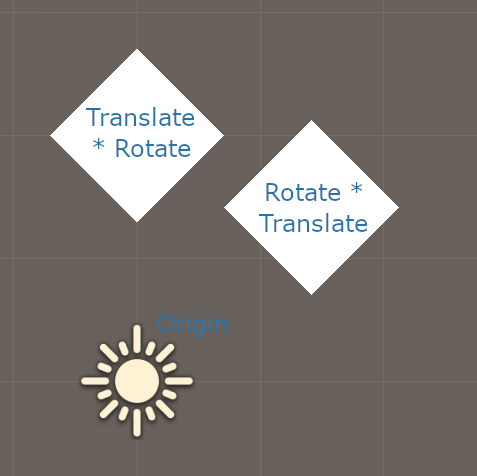

# Unity Matrix Order

Minimal project to outline matrix application in Unity.

The picture below shows two cubes with the corresponding applied matrix.

This shows that matrix are applied **from right to left**. The corollary is vectors are seen as columns.

Note: matrix components are accessed in row-major order, i.e. with `Matrix4x4[row,column]` and `Matrix4x4.m<row><column>`. Therefore, `Matrix4x4.m03` is the X-Translate component.
